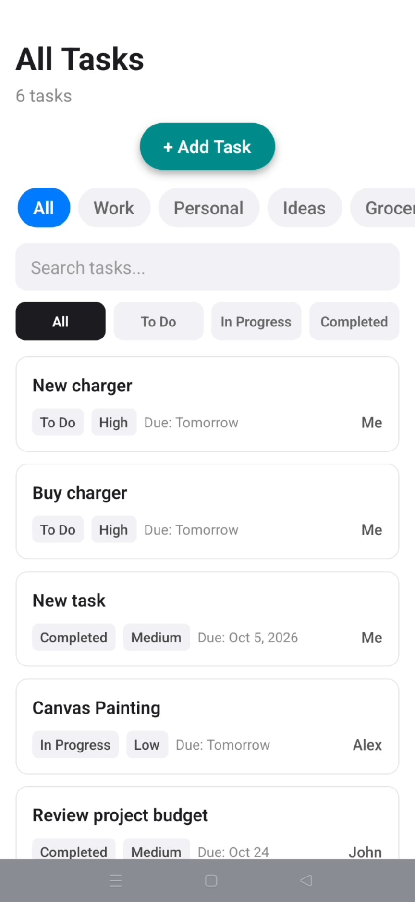
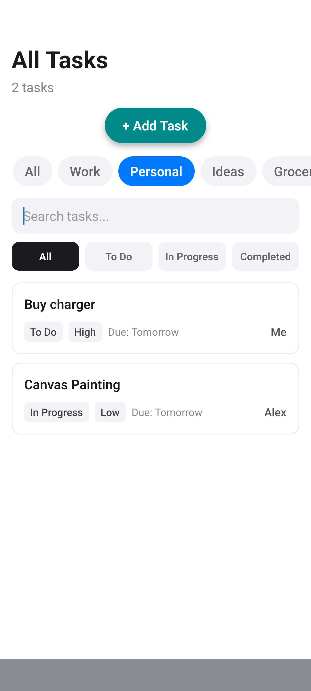
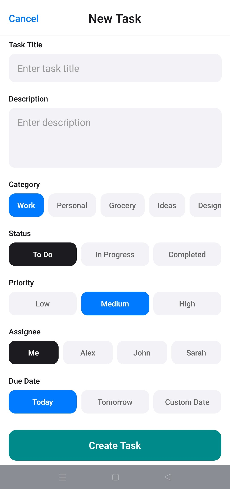
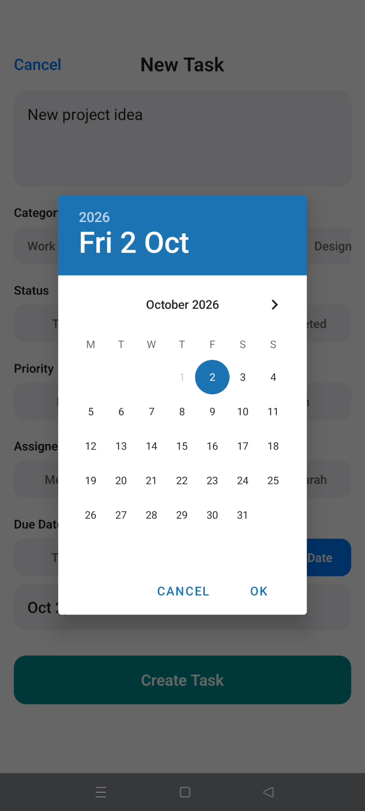
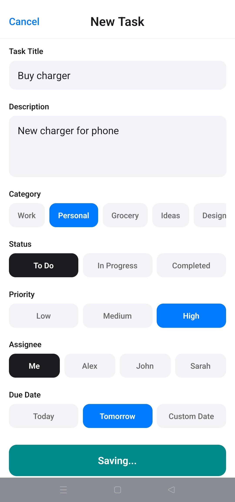
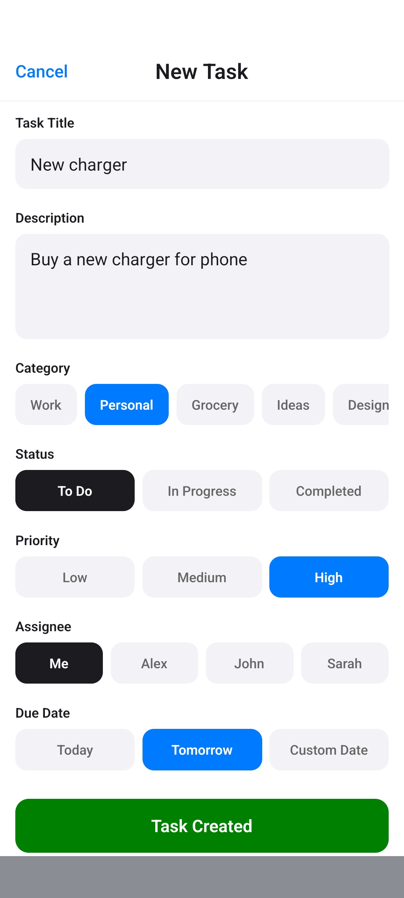
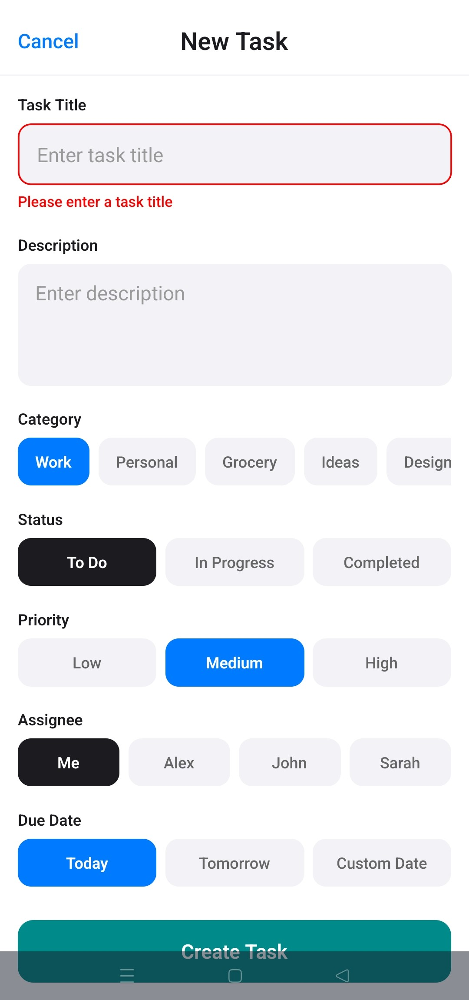

# TaskManagerApp

A modern, offline-first mobile task management application built with **React Native**, **Expo Router**, and **TypeScript**. Features dynamic category filtering, search, task creation with custom date selection and persistent local storage via AsyncStorage.

---

## Features

- **Task Overview & Filtering:** Browse tasks filtered by project categories (*Work*, *Personal*, *Design*, etc.) and completion status (*To Do*, *In Progress*, *Completed*).
- **Instant Search:** Real-time search by task title.
- **Task Creation:** Create tasks with custom categories, priority levels (*Low*, *Medium*, *High*), assignees, and due dates via native date pickers.
- **Offline Persistence:** Tasks persist locally on the device using `@react-native-async-storage/async-storage`.
- **Dynamic Safe Area & Status Bar:** Seamless notch and status bar styling across modern iOS and Android devices.
- **Modular Component Architecture:** Clean separation of concerns with atomic, reusable components.

---

## Screenshots

### 1. Main Screens

| Screen 1: Task List | Category Filtered | Screen 2: Create Task |
|:---:|:---:|:---:|
|  |  |  |

### 2. Form Flow

| Form Fields & Options | Native Date Picker | Saving in Progress | Task Created |
|:---:|:---:|:---:|:---:|
|  |  |  |  |

### 3. Application States

| Loading State | Saving State | Error State | Successful Save State | Empty State |
|:---:|:---:|:---:|:---:|:---:|
|  |  |  |  |  |

---

## Tech Stack

| Category | Technology |
|---|---|
| **Framework** | [Expo](https://expo.dev/) (SDK 57) / [React Native](https://reactnative.dev/) |
| **Routing** | [Expo Router](https://docs.expo.dev/router/introduction/) (File-based navigation) |
| **Language** | [TypeScript](https://www.typescriptlang.org/) |
| **State Management** | React Context API (`TasksContext`) |
| **Local Storage** | [`@react-native-async-storage/async-storage`](https://react-native-async-storage.github.io/async-storage/) |
| **Date Picker** | [`@react-native-community/datetimepicker`](https://github.com/react-native-datetimepicker/datetimepicker) |
| **Styling** | React Native `StyleSheet` |

---

## Prerequisites

Before running the project, ensure you have the following installed:

- **[Node.js](https://nodejs.org/)** (v18.x or higher, LTS recommended)
- **npm** (comes with Node.js)
- **Expo Go** app on your physical iOS or Android device or a configured Android Emulator / iOS Simulator.

---

## Getting Started

### 1. Clone & Navigate to Project

```bash
git clone https://github.com/KHAGENDRA0P/TaskManagerApp
cd TaskManagerApp
```

### 2. Install Dependencies

Always install dependencies using `npm install` or `npx expo install`:

```bash
npm install
```

### 3. Start the Development Server

Start the local Expo development server:

```bash
npx expo start -c
```

> **Note:** The `-c` flag clears Metro bundler cache to prevent stale bundles or memory bloat.

### 4. Open the App

- **Physical Device:** Open the **Expo Go** app and scan the QR code displayed in your terminal.
- **Android Emulator:** Press `a` in the terminal (or run `npm run android`).
- **iOS Simulator:** Press `i` in the terminal (or run `npm run ios`, macOS required).
- **Web Browser:** Press `w` in the terminal (or run `npm run web`).

---

## Project Structure

```text
src/
├── app/                  # Route screens (Expo Router)
│   ├── _layout.tsx       # Root layout + Providers + StatusBar
│   ├── index.tsx         # Home screen ("/")
│   └── create-task.tsx   # New task screen ("/create-task")
├── components/           # Feature-sliced component modules
│   ├── TaskList/         # Task list components & filters
│   ├── CreateTask/       # Task form components & date picker
│   └── common/           # Shared UI states (Loading, Empty, Error)
├── context/              # Global state & AsyncStorage persistence
└── data/                 # Default initial tasks mock dataset
```

---

## License

This project is open source and available under the [MIT License](LICENSE).
